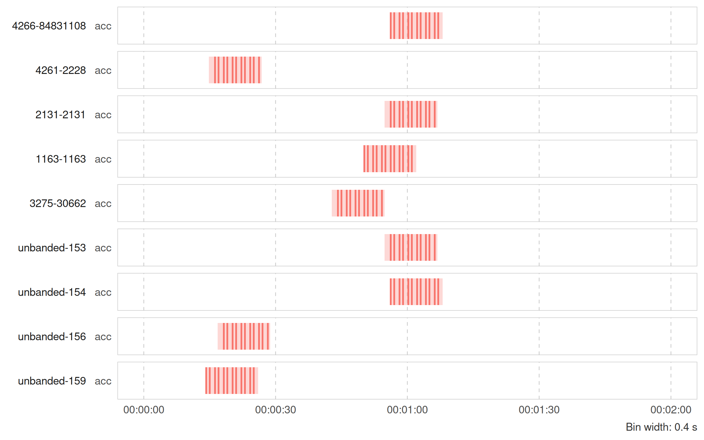

<!-- README.md is generated from README.Rmd. Please edit that file -->

# move2imu

<!-- badges: start -->

[](https://github.com/move2universe/move2imu/actions/workflows/R-CMD-check.yaml)
[](https://app.codecov.io/gh/move2universe/move2imu)
[](https://CRAN.R-project.org/package=move2imu)
[](https://lifecycle.r-lib.org/articles/stages.html#experimental)
<!-- badges: end -->

move2imu aims to standardize the storage and analysis of biologging
inertial measurement unit (IMU) data, including accelerometer,
magnetometer, and gyroscope records. The package integrates with
[move2](https://bartk.gitlab.io/move2/), enabling standardized data
processing workflows and allowing IMU data to be analyzed alongside
other observations, including location records.

## Installation

move2imu does not yet exist on CRAN. Instead, you can install the
development version directly:

``` r
# install.packages("pak")
pak::pak("move2universe/move2imu")

# Or, if remotes is already installed:
remotes::install_github("move2universe/move2imu")
```

## Usage

Extract and standardize IMU bursts from a `move2` object or a
`data.frame`:

``` r
library(move2imu)
library(move2)

# Extract acceleration data from gulls data
a <- as_acc(gulls())
a <- a[!is.na(a)]

head(a)
#> <acceleration[6]>
#> [1] (-97.75 323.55 1963.95) (-95 267.65 1914.25)    (7.1 301.85 1990.9)    
#> [4] (77.65 372.95 1824.75)  (46.9 349.8 1989)       (-29.15 251.05 2046.6) 
#> # frequency: 20 [Hz]

# Overview of acceleration bursts
summary(a)
#> 59 acc bursts
#> from 2021-03-03 00:57:06 to 2021-03-03 23:44:55 UTC 
#> 
#> Axes: XYZ (59) 
#> Frequencies: 20 -- 20 [Hz] 
#> Samples per burst: 20 -- 20 
#> Durations: 1 -- 1 [s] 
#> Intervals: [ 1197 / 1199 / 1200.5 / 1214.75 / 3624 ] [s]  (min/Q1/med/Q3/max) 
#> 
#> Values:  [ -1383 / 142 / 355 / 1782.25 / 4073 ]  (min/Q1/med/Q3/max) 
#> Units:   NULL
```

Calibrate tags:

``` r
# Standardize raw ADC counts to physical units with a built-in tag calibration
a <- transform_imu(a, acc_calibration("ornitela", units = "standard_free_fall"))

head(a)
#> <acceleration[6]>
#> [1] (-0.1 0.32 1.96) [standard_free_fall] 
#> [2] (-0.1 0.27 1.91) [standard_free_fall] 
#> [3] (0.01 0.3 1.99) [standard_free_fall]  
#> [4] (0.08 0.37 1.82) [standard_free_fall] 
#> [5] (0.05 0.35 1.99) [standard_free_fall] 
#> [6] (-0.03 0.25 2.05) [standard_free_fall]
#> # frequency: 20 [Hz]
```

Visualize sampling regimes:

``` r
# Visualize sampling patterns in your data
alb <- albatrosses()
a <- as_acc(alb)

plot_sampling_effort(
  acc = a,
  ids = mt_track_id(alb),
  from = as.POSIXct("2008-07-27 00:00:00", tz = "UTC"),
  to = as.POSIXct("2008-07-27 00:02:00", tz = "UTC")
)
```



Compute metrics:

``` r
# Calibrate e-obs tags to g units
a <- transform_imu(
  a, 
  acc_calibration(
    "eobs", 
    tag_id = 1000, 
    sensitivity = "low",
    units = "standard_free_fall"
  )
)

# Compute VeDBA using 3-second running mean
vedba(a, window = units::set_units(3, "s"))
#> Units: [standard_free_fall]
#>  [1]          NA 0.068884904 0.072239477 0.064800946 0.058539038 0.072790297
#>  [7]          NA 0.073737447 0.132444286 0.102806719 0.068233055 0.060682279
#> [13] 0.236549955          NA 0.236350722 0.114085328 0.089494390 0.090803532
#> [19] 0.175975707          NA 0.083250335 0.222811565 0.040281270 0.138025808
#> [25] 0.053777846          NA 0.072020377 0.078039083 0.045069801 0.059042416
#> [31] 0.342381587          NA 0.034573195 0.011673462 0.009311533 0.010207175
#> [37] 0.011146326          NA 0.010442567 0.010344942 0.011322390 0.012764422
#> [43] 0.010587842          NA 0.033883944 0.012618563 0.010646915 0.018909796
#> [49] 0.210175793          NA 0.065469180 0.068091649 0.063682861 0.068620226
```

## Getting help + Contributing

We welcome feedback and contributions. If you encounter a bug or have
specific feature requests, please create an issue on
[GitHub](https://github.com/move2universe/move2imu).
