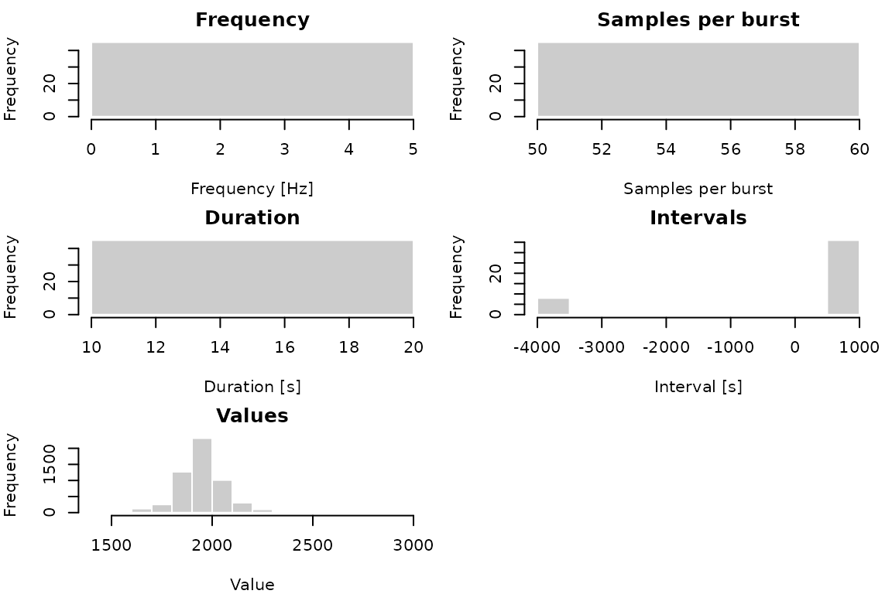
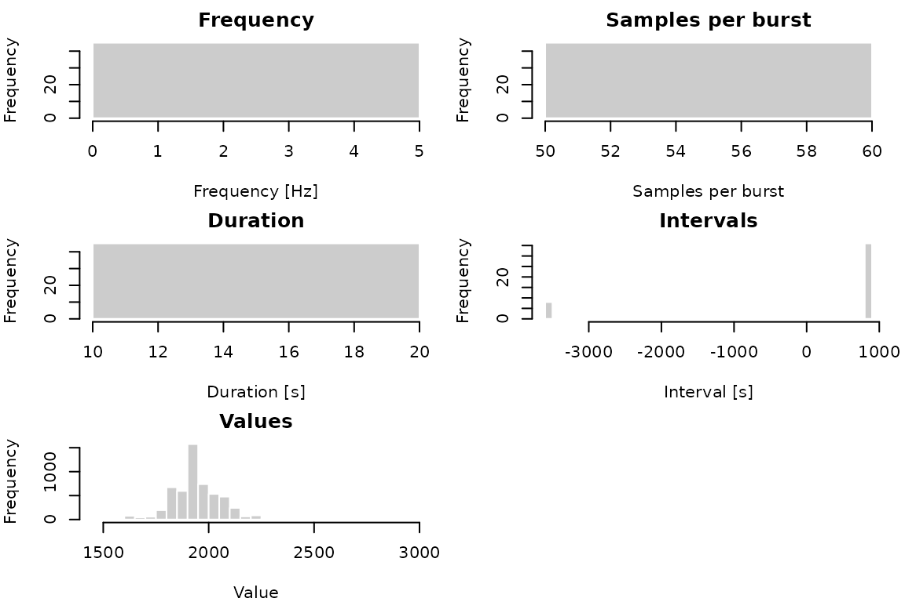

# Introduction to move2imu

Biologging devices often record information about an animal’s behavior
using an inertial measurement unit (IMU) that collects acceleration,
magnetometer, and/or orientation data. Because collecting these data can
be battery- and storage-intensive, they are often recorded
intermittently in rapid sets of samples at a fixed frequency, which we
will refer to as *bursts*. These bursts of IMU measurements provide
regular snapshots of an animal’s behavior and activity.

(Note that while some IMUs allow you to record data continuously for
longer periods of time, we still use the term *burst* to refer to a
distinct set of fixed-frequency IMU data samples, regardless of how long
such a “burst” lasts.)

move2imu provides an R vector representation of these bursts so that
they can be easily manipulated, analyzed, and linked to other tracking
data—for instance, those stored in a `move2` object. The package
currently supports three sensor types:

- [`acc()`](https://robe2037.github.io/move2imu/reference/imu_constructors.md)
  for accelerometer bursts
- [`mag()`](https://robe2037.github.io/move2imu/reference/imu_constructors.md)
  for magnetometer bursts
- [`gyro()`](https://robe2037.github.io/move2imu/reference/imu_constructors.md)
  for gyroscope bursts

Each of these shares the same underlying structure. For the rest of this
vignette, we will use acceleration data as an example.

``` r

library(move2imu)
library(move2)
library(dplyr)
```

## Burst structure

You can create an `acc` vector from scratch by providing a list of burst
matrices (containing the raw acceleration data) and the associated
sampling frequency for those observations. Each burst can contain up to
three recording axes: `X`, `Y`, and/or `Z`. Note that the frequency must
be provided in frequency units (in this case, `"Hz"`). move2imu uses the
[units](https://r-quantities.github.io/units/) package to support unit
manipulation.

``` r

raw_acc <- cbind(
  X = sin(1:30 / 10),
  Y = cos(1:30 / 10),
  Z = 1:30 / 10
)

a1 <- acc(
  bursts = list(raw_acc),
  frequency = units::as_units(40, "Hz")
)

a1
#> <acceleration[1]>
#> [1] (0.67 0.01 1.55)
#> # frequency: 40 [Hz]
```

The printed output of the vector shows the number of bursts as well as
the mean value per axis for each burst. Internally, the raw data matrix
is preserved.

Bursts can also be associated with a timestamp marking the start time of
the burst:

``` r

a2 <- acc(
  bursts = list(
    cbind(X = sin(1:20 / 10), Y = cos(1:20 / 10)),
    cbind(X = sin(1:20 / 10 + 2), Y = cos(1:20 / 10 + 3))
  ),
  frequency = units::as_units(30, "Hz"),
  start = as.POSIXct(c("2026-06-01 00:00:00", "2026-06-01 00:01:00"), tz = "UTC")
)
```

Multiple `acc` vectors can be combined with
[`c()`](https://rdrr.io/r/base/c.html), even if their sampling
frequency, axes, or other properties vary:

``` r

a <- c(a1, a2)

a
#> <acceleration[3]>
#> [1] (0.67 0.01 1.55) (0.73 0.42)      (0.08 -0.52)    
#> # frequency: 30 [Hz] - 40 [Hz]
```

## Loading IMU data

Of course, in most cases you won’t be building bursts from scratch, but
will load these data from external sources. move2imu has been designed
to work in tandem with [move2](https://bartk.gitlab.io/move2/) and
[Movebank](https://www.movebank.org) and will automatically parse IMU
data stored in one of Movebank’s standard storage formats (see
[`movebank_acc_colsets()`](https://robe2037.github.io/move2imu/reference/movebank_colsets.md)).

For example, we’ll load a sample dataset of albatross tracks stored as a
`move2`:

``` r

# Load sample Movebank data into a `move2`
alb <- albatrosses()

alb
#> A <move2> with `track_id_column` "individual_local_identifier" and
#> `time_column` "timestamp"
#> Containing 9 tracks lasting on average 59.3 mins in a
#> Simple feature collection with 54 features and 21 fields (with 45 geometries empty)
#> Geometry type: POINT
#> Dimension:     XY
#> Bounding box:  xmin: -89.67882 ymin: -9.06721 xmax: -78.67636 ymax: -1.025846
#> Geodetic CRS:  WGS 84
#> # A tibble: 54 × 22
#>    sensor_type_id individual_local_identifier eobs_battery_voltage
#>  *        <int64> <fct>                                       [mV]
#>  1            653 4266-84831108                               3759
#>  2        2365683 4266-84831108                                 NA
#>  3        2365683 4266-84831108                                 NA
#>  4        2365683 4266-84831108                                 NA
#>  5        2365683 4266-84831108                                 NA
#>  6        2365683 4266-84831108                                 NA
#>  7            653 4261-2228                                   3720
#>  8        2365683 4261-2228                                     NA
#>  9        2365683 4261-2228                                     NA
#> 10        2365683 4261-2228                                     NA
#> # ℹ 44 more rows
#> # ℹ 19 more variables: eobs_fix_battery_voltage [mV],
#> #   eobs_horizontal_accuracy_estimate [m], eobs_key_bin_checksum <int64>,
#> #   eobs_speed_accuracy_estimate [m/s], eobs_start_timestamp <dttm>,
#> #   eobs_status <ord>, eobs_temperature [°C], eobs_type_of_fix <fct>,
#> #   eobs_used_time_to_get_fix [s], ground_speed [m/s], heading [°],
#> #   height_above_ellipsoid [m], timestamp <dttm>, visible <lgl>, …
#> Track features:
#> # A tibble: 9 × 52
#>   deployment_id  tag_id individual_id animal_life_stage attachment_type
#>         <int64> <int64>       <int64> <fct>             <fct>          
#> 1       9472222 2911134       2911065 adult             tape           
#> 2       9472220 2911111       2911067 adult             tape           
#> 3       9472218 2911109       2911060 adult             tape           
#> 4       9472214 2911130       2911066 adult             tape           
#> 5       9472208 2911108       2911074 adult             tape           
#> 6       2911178 2911132       2911094 adult             tape           
#> 7       2911168 2911129       2911093 adult             tape           
#> 8       2911167 2911127       2911092 adult             tape           
#> 9       2911150 2911126       2911091 adult             tape           
#> # ℹ 47 more variables: deployment_comments <chr>, deploy_on_timestamp <dttm>,
#> #   duty_cycle <chr>, deployment_local_identifier <fct>,
#> #   manipulation_type <fct>, study_site <chr>, tag_readout_method <fct>,
#> #   sensor_type_ids <chr>, capture_location <POINT [°]>,
#> #   deploy_on_location <POINT [°]>, deploy_off_location <POINT [°]>,
#> #   individual_comments <chr>, individual_local_identifier <fct>,
#> #   taxon_canonical_name <fct>, individual_number_of_deployments <int>, …
```

Then, to extract the acceleration data from this object, we simply call
[`as_acc()`](https://robe2037.github.io/move2imu/reference/as_acc.md):

``` r

a <- as_acc(alb)

a
#> <acceleration[54]>
#>  [1] <NA>              (1824.17 1913.83) (1904.3 1926.5)   (1823.27 1913.42)
#>  [5] (1826.7 1915.7)   (1719.07 1908.8)  <NA>              (1943.47 2028.05)
#>  [9] (1927.98 2013.72) (1926.7 2008.82)  (1940.97 2023.93) (1940.02 2021.87)
#> [13] (1969.07 2044.2)  <NA>              (1962.88 2033.35) (2062.08 2023.48)
#> [17] (2090.73 2025.83) (2083.92 2051.48) (1887.58 1927.13) <NA>             
#> [21] (1846.38 1948.13) (1881.15 1938.03) (1841.58 2093.23) (1778.92 2129.55)
#> [25] (1812.17 1952.13) <NA>              (1790.4 1927.4)   (1811.85 1923.43)
#> [29] (1804.47 1935.05) (1811.45 1937.57) (2012.53 2227.17) <NA>             
#> [33] (1970.52 2238.62) (2130.75 2082.43) (1997.18 2074.33) (2049.4 2060.38) 
#> [37] (1975.93 1868.22) <NA>              (1920.02 2128.58) (1879.35 1920.62)
#> [41] (1927.5 1941.72)  (1949.27 1962.57) (1936.87 1918.93) <NA>             
#> [45] (1672.52 1865.77) (1942.15 1922.33) (2072.85 1952.1)  (1617.97 1944.63)
#> [49] (1845.87 1921.13) <NA>              (1838.77 1929.6)  (1843.57 1929.52)
#> [53] (1852.25 1929.65) (1829.97 1932.28)
#> # frequency: 5 [Hz]
```

[`as_acc()`](https://robe2037.github.io/move2imu/reference/as_acc.md)
automatically identifies the relevant acceleration data in the albatross
data and converts them into bursts with associated frequencies and start
timestamps.

By default, rows in the `move2` with no acceleration data receive
missing (`NA`) `acc` bursts. This makes it easy to keep acceleration
bursts linked to other metadata stored in the `move2`, like GPS
location:

``` r

alb |>
  mutate(acceleration = a) |>
  select(acceleration)
#> A <move2> with `track_id_column` "individual_local_identifier" and
#> `time_column` "timestamp"
#> Containing 9 tracks lasting on average 59.3 mins in a
#> Simple feature collection with 54 features and 3 fields (with 45 geometries empty)
#> Geometry type: POINT
#> Dimension:     XY
#> Bounding box:  xmin: -89.67882 ymin: -9.06721 xmax: -78.67636 ymax: -1.025846
#> Geodetic CRS:  WGS 84
#> # A tibble: 54 × 4
#>         acceleration              geometry timestamp          
#>                <acc>           <POINT [°]> <dttm>             
#>  1                NA  (-78.67636 -9.06721) 2008-07-27 00:00:56
#>  2 (1824.17 1913.83)                 EMPTY 2008-07-27 00:00:56
#>  3   (1904.3 1926.5)                 EMPTY 2008-07-27 00:15:00
#>  4 (1823.27 1913.42)                 EMPTY 2008-07-27 00:30:00
#>  5   (1826.7 1915.7)                 EMPTY 2008-07-27 00:45:00
#>  6  (1719.07 1908.8)                 EMPTY 2008-07-27 01:00:00
#>  7                NA (-89.45139 -2.083909) 2008-07-27 00:00:15
#>  8 (1943.47 2028.05)                 EMPTY 2008-07-27 00:00:15
#>  9 (1927.98 2013.72)                 EMPTY 2008-07-27 00:15:00
#> 10  (1926.7 2008.82)                 EMPTY 2008-07-27 00:30:00
#> # ℹ 44 more rows
#> # ℹ 1 more variable: individual_local_identifier <fct>
#> Track features:
#> # A tibble: 9 × 52
#>   deployment_id  tag_id individual_id animal_life_stage attachment_type
#>         <int64> <int64>       <int64> <fct>             <fct>          
#> 1       9472222 2911134       2911065 adult             tape           
#> 2       9472220 2911111       2911067 adult             tape           
#> 3       9472218 2911109       2911060 adult             tape           
#> 4       9472214 2911130       2911066 adult             tape           
#> 5       9472208 2911108       2911074 adult             tape           
#> 6       2911178 2911132       2911094 adult             tape           
#> 7       2911168 2911129       2911093 adult             tape           
#> 8       2911167 2911127       2911092 adult             tape           
#> 9       2911150 2911126       2911091 adult             tape           
#> # ℹ 47 more variables: deployment_comments <chr>, deploy_on_timestamp <dttm>,
#> #   duty_cycle <chr>, deployment_local_identifier <fct>,
#> #   manipulation_type <fct>, study_site <chr>, tag_readout_method <fct>,
#> #   sensor_type_ids <chr>, capture_location <POINT [°]>,
#> #   deploy_on_location <POINT [°]>, deploy_off_location <POINT [°]>,
#> #   individual_comments <chr>, individual_local_identifier <fct>,
#> #   taxon_canonical_name <fct>, individual_number_of_deployments <int>, …
```

### Input data formats

The Movebank data model supports several storage formats for
acceleration data. However, move2imu handles this heterogeneity out of
the box:

``` r

# Sample Movebank data
gul <- gulls()

as_acc(gul)
#> <acceleration[1239]>
#>    [1] <NA>                     (-97.75 323.55 1963.95) 
#>    [3] <NA>                     <NA>                    
#>    [5] <NA>                     <NA>                    
#>    [7] <NA>                     <NA>                    
#>    [9] <NA>                     <NA>                    
#>   [11] <NA>                     <NA>                    
#>   [13] <NA>                     <NA>                    
#>   [15] <NA>                     <NA>                    
#>   [17] <NA>                     <NA>                    
#> ...
```

Even though the albatross and gulls data sources store their
acceleration data differently, because each adheres to the Movebank data
model,
[`as_acc()`](https://robe2037.github.io/move2imu/reference/as_acc.md)
seamlessly parses the data into a set of `acc` burst matrices.

For more details about the ways Movebank stores acceleration data, see
[`movebank_acc_colsets()`](https://robe2037.github.io/move2imu/reference/movebank_colsets.md).

### Fine-tuning data import

If you have your own data stored using column names that don’t adhere to
the Movebank data model, you can still use
[`as_acc()`](https://robe2037.github.io/move2imu/reference/as_acc.md) to
load them, provided that the data themselves are stored in a
recognizable format (see
[`imu_colset()`](https://robe2037.github.io/move2imu/reference/imu_colset.md)).
Use
[`imu_colset()`](https://robe2037.github.io/move2imu/reference/imu_colset.md)
to define the column names that correspond to each axis of acceleration
data in your input data source:

``` r

# Extract acc data from the "acc_x" and "acc_y" columns
a <- as_acc(x, colset = imu_colset(x = "acc_x", y = "acc_y"))
```

## Exploring bursts

For a quick summary of an IMU vector, use
[`summary()`](https://rdrr.io/r/base/summary.html). This shows the range
of several key burst properties as well as the quantiles of the
inter-burst time intervals and the actual recorded burst values.

``` r

a <- as_acc(albatrosses())

s <- summary(a)

s
#> 54 acc bursts (9 NA)
#> from 2008-07-27 00:00:14 to 2008-07-27 01:00:00 UTC 
#> 
#> Axes: XY (45) 
#> Frequencies: 5 -- 5 [Hz] 
#> Samples per burst: 60 -- 60 
#> Durations: 12 -- 12 [s] 
#> Intervals: [ -3598 / 833 / 888 / 888 / 891 ] [s]  (min/Q1/med/Q3/max) 
#> 
#> Values:  [ 1462 / 1875 / 1936 / 2010 / 2988 ]  (min/Q1/med/Q3/max) 
#> Units:   [no units]
```

Plotting the saved summary will display histograms of several of the key
burst properties:

``` r

plot(s)
```



You can also select individual panels and modify plot parameters to
explore the distributions in more depth:

``` r

plot(s, which = "Values", breaks = 50)
#> Warning in plot.window(xlim, ylim, log, ...): "which" is not a graphical
#> parameter
#> Warning in title(main = main, sub = sub, xlab = xlab, ylab = ylab, ...):
#> "which" is not a graphical parameter
#> Warning in axis(1, ...): "which" is not a graphical parameter
#> Warning in axis(2, at = yt, ...): "which" is not a graphical parameter
#> Warning in plot.window(xlim, ylim, log, ...): "which" is not a graphical
#> parameter
#> Warning in title(main = main, sub = sub, xlab = xlab, ylab = ylab, ...):
#> "which" is not a graphical parameter
#> Warning in axis(1, ...): "which" is not a graphical parameter
#> Warning in axis(2, at = yt, ...): "which" is not a graphical parameter
#> Warning in plot.window(xlim, ylim, log, ...): "which" is not a graphical
#> parameter
#> Warning in title(main = main, sub = sub, xlab = xlab, ylab = ylab, ...):
#> "which" is not a graphical parameter
#> Warning in axis(1, ...): "which" is not a graphical parameter
#> Warning in axis(2, at = yt, ...): "which" is not a graphical parameter
#> Warning in plot.window(xlim, ylim, log, ...): "which" is not a graphical
#> parameter
#> Warning in title(main = main, sub = sub, xlab = xlab, ylab = ylab, ...):
#> "which" is not a graphical parameter
#> Warning in axis(1, ...): "which" is not a graphical parameter
#> Warning in axis(2, at = yt, ...): "which" is not a graphical parameter
#> Warning in plot.window(xlim, ylim, log, ...): "which" is not a graphical
#> parameter
#> Warning in title(main = main, sub = sub, xlab = xlab, ylab = ylab, ...):
#> "which" is not a graphical parameter
#> Warning in axis(1, ...): "which" is not a graphical parameter
#> Warning in axis(2, at = yt, ...): "which" is not a graphical parameter
```



move2imu also provides several helpers to directly access burst
properties. For instance:

``` r

# Number of samples per burst
n_samples(a)
#>  [1] NA 60 60 60 60 60 NA 60 60 60 60 60 60 NA 60 60 60 60 60 NA 60 60 60 60 60
#> [26] NA 60 60 60 60 60 NA 60 60 60 60 60 NA 60 60 60 60 60 NA 60 60 60 60 60 NA
#> [51] 60 60 60 60

# Burst duration, in seconds
burst_dur(a)
#> Units: [s]
#>  [1] NA 12 12 12 12 12 NA 12 12 12 12 12 12 NA 12 12 12 12 12 NA 12 12 12 12 12
#> [26] NA 12 12 12 12 12 NA 12 12 12 12 12 NA 12 12 12 12 12 NA 12 12 12 12 12 NA
#> [51] 12 12 12 12

# Check whether all bursts have same frequency, samples, axes, units
is_uniform(a)
#> [1] TRUE

# and more...
```

If you need to operate on the burst data or metadata directly, they can
easily be accessed as well:

``` r

bursts(a)
#> <acc_list[54]>
#> [[1]]
#> NULL
#> 
#> [[2]]
#>          X    Y
#>  [1,] 1856 1900
#>  [2,] 1816 1931
#>  [3,] 1812 1902
#>  [4,] 1826 1920
#> ...

freqs(a)
#> Units: [Hz]
#>  [1] NA  5  5  5  5  5 NA  5  5  5  5  5  5 NA  5  5  5  5  5 NA  5  5  5  5  5
#> [26] NA  5  5  5  5  5 NA  5  5  5  5  5 NA  5  5  5  5  5 NA  5  5  5  5  5 NA
#> [51]  5  5  5  5

starts(a)
#>  [1] NA                        "2008-07-27 00:00:56 UTC"
#>  [3] "2008-07-27 00:15:00 UTC" "2008-07-27 00:30:00 UTC"
#>  [5] "2008-07-27 00:45:00 UTC" "2008-07-27 01:00:00 UTC"
#>  [7] NA                        "2008-07-27 00:00:15 UTC"
#>  [9] "2008-07-27 00:15:00 UTC" "2008-07-27 00:30:00 UTC"
#> [11] "2008-07-27 00:45:00 UTC" "2008-07-27 01:00:00 UTC"
#> [13] "2008-07-27 00:00:55 UTC" NA                       
#> [15] "2008-07-27 00:15:00 UTC" "2008-07-27 00:30:00 UTC"
#> [17] "2008-07-27 00:45:00 UTC" "2008-07-27 01:00:00 UTC"
#> [19] "2008-07-27 00:00:50 UTC" NA                       
#> ...
```

### Plotting bursts

You can also plot the acceleration data over time with
[`plot_time()`](https://robe2037.github.io/move2imu/reference/plot_time.md).
This produces an interactive
[`dygraph`](https://rstudio.github.io/dygraphs/) that you can zoom into
with the mouse:

``` r

a <- as_acc(gulls())

plot_time(a)
```

You can also pass a single burst (or a subset) for a focused view —
here, the wing beats are clearly visible on the Z axis:

``` r

plot_time(a[422])
```

## Next steps

If your data are stored as raw ADC values rather than physical units,
see the [calibration
vignette](https://robe2037.github.io/move2imu/articles/calibration.md)
to learn how to convert them.

See the [programming with
bursts](https://robe2037.github.io/move2imu/articles/programming.md)
vignette for a demonstration of how to compute values from `acc` bursts
and link them back to GPS coordinates in a `move2` object.
