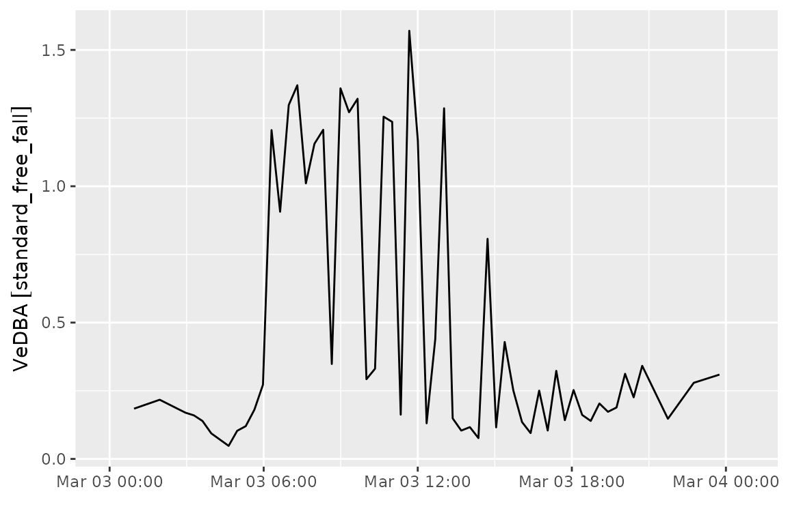
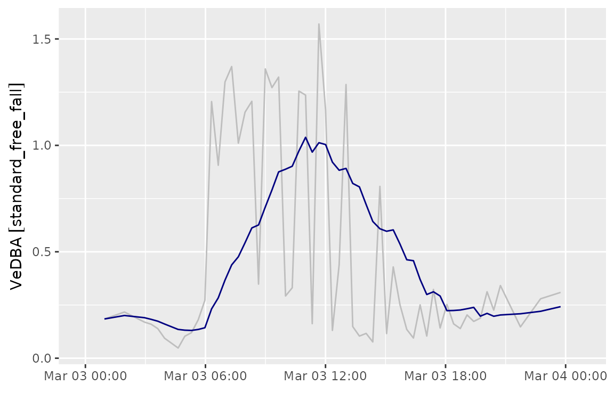
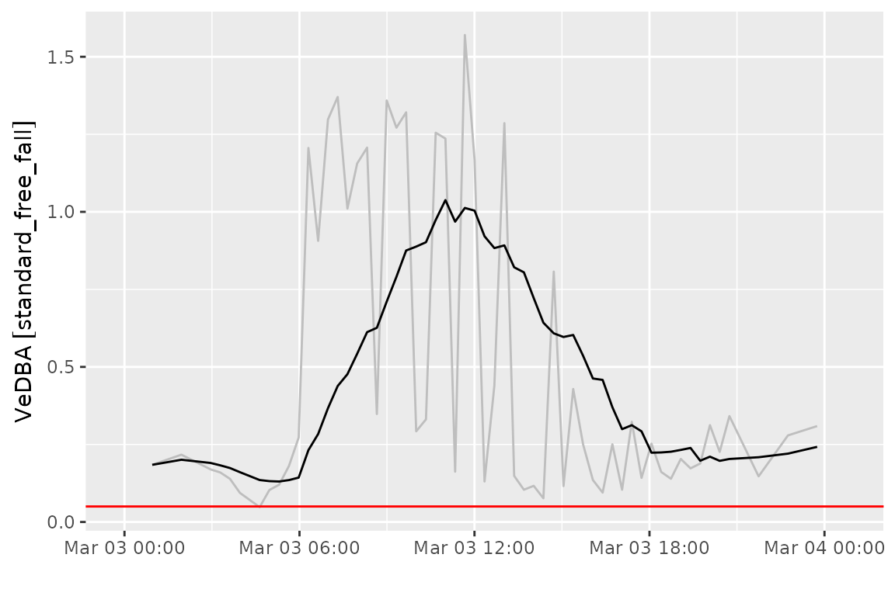
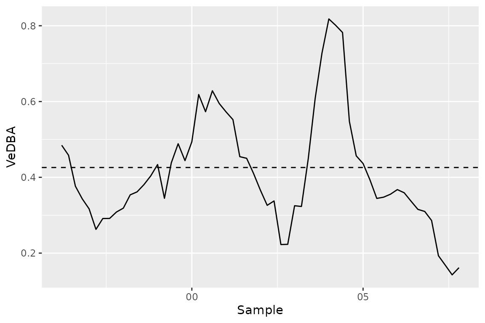

# Programming with IMU bursts

After extracting IMU data into a vector of bursts, we typically will
want to summarize the individual burst samples into a more interpretable
measure of activity. This vignette shows how to extract simple activity
metrics from `acc` bursts and reattach these metrics to corresponding
location data collected with GPS.

``` r

library(move2imu)
library(move2)
library(dplyr)
library(units)
```

We’ll use the move2imu gulls data for this demo:

``` r

gul <- gulls()
```

And then extract our acceleration bursts:

``` r

gul$acceleration <- as_acc(gul)

gul$acceleration[1:10]
#> <acceleration[10]>
#>  [1] <NA>                    (-97.75 323.55 1963.95) <NA>                   
#>  [4] <NA>                    <NA>                    <NA>                   
#>  [7] <NA>                    <NA>                    <NA>                   
#> [10] <NA>                   
#> # frequency: 20 [Hz]
```

## Dynamic body acceleration

As a simple example, imagine if we wanted to compute the vectorial
dynamic body acceleration (VeDBA) for these bursts, and link each of
those VeDBA values to the closest GPS location record.

VeDBA is computed by:

1.  subtracting the per-axis mean of a burst (the static, gravity-driven
    component) from each sample, leaving the dynamic component, and
2.  taking the mean Euclidean norm of the dynamic component across
    samples.

First, we need to convert our raw acceleration values into physical
units. (This is covered in depth in the [calibration
vignette](https://move2universe.github.io/move2imu/articles/calibration.md).)
We will use the standard transformation for Ornitela tags here (TODO:
what tags are used here?)

``` r

gul$acceleration <- transform_imu(
  gul$acceleration,
  acc_calibration("ornitela", units = "standard_free_fall")
)
```

We can write a custom function that ingests an acceleration vector and
computes VeDBA on each burst:

``` r

vedba <- function(acc) {
  purrr::map_dbl(
    bursts(acc),
    function(b) {
      # If no data, return NA
      if (rlang::is_null(b)) {
        return(NA_real_)
      }
      
      b <- drop_units(b)
      dba <- t(b) - colMeans(b)
      mean(sqrt(colSums(dba^2)))
    }
  )
}
```

We can then apply this function to each element of our acceleration
vector. First, we confirm that we have a standard unit for all bursts.
That way, we can safely reattach that unit after computation:

``` r

# Confirm that we have a single standard unit across all bursts:
unique(imu_units(gul$acceleration[!is.na(gul$acceleration)]))
#> [1] "standard_free_fall"
```

Now we can compute VeDBA for all bursts:

``` r

v <- set_units(vedba(gul$acceleration), "standard_free_fall")
head(v)
#> Units: [standard_free_fall]
#> [1]        NA 0.1843255        NA        NA        NA        NA
```

We can put these values directly into our dataframe alongside the other
event data for that record:

``` r

gul_v <- gul |>
  mutate(vedba = v) |>
  filter(!is.na(vedba)) |>
  select(vedba)
```

``` r

library(ggplot2)

ggplot() +
  geom_line(data = gul_v, aes(x = mt_time(gul_v), y = vedba)) +
  labs(x = "", y = "VeDBA") +
  scale_x_datetime(expand = expansion(mult = 0.1))
```



If we’re interested in how these changes are expressed in space, we need
to reattach the computed VeDBA to the recorded GPS locations for our
gull. However, the acceleration data is not directly linked with a
particular location. We can see that these records are associated with
`POINT EMPTY` geometries:

``` r

gul_v$geometry
#> Geometry set for 59 features  (with 59 geometries empty)
#> Geometry type: POINT
#> Dimension:     XY
#> Bounding box:  xmin: NA ymin: NA xmax: NA ymax: NA
#> Geodetic CRS:  WGS 84
#> First 5 geometries:
#> POINT EMPTY
#> POINT EMPTY
#> POINT EMPTY
#> POINT EMPTY
#> POINT EMPTY
```

The tag did record locations, though—it’s simply that these records are
stored in the GPS rows of the input move2 object, not the acceleration
rows. So, we need to relink our VeDBA values with the corresponding GPS
location at the same timestamp. First, we’ll drop the empty geometry
column from our VeDBA data and restrict our location data just to those
records with spatial information:

``` r

# Drop geometry column, which is empty for our acc records:
gul_v <- sf::st_drop_geometry(gul_v)

# Extract location records
gul_gps <- gul[!sf::st_is_empty(gul), ]
```

Then, we can use
[`dplyr::left_join()`](https://dplyr.tidyverse.org/reference/mutate-joins.html)
to reattach the two, linking by the track ID and the timestamp. (We use
the move2 helpers
[`mt_track_id_column()`](https://bartk.gitlab.io/move2/reference/column_name.html)
and
[`mt_time_column()`](https://bartk.gitlab.io/move2/reference/column_name.html)
to ensure the correct metadata columns are used for the join, as the
precise names of these columns can differ across data sources.)

``` r

# Specify that the track ID columns and timestamp columns should match,
# regardless of the exact column names:
join <- setNames(
  c(mt_track_id_column(gul_v), mt_time_column(gul_v)),
  c(mt_track_id_column(gul_gps), mt_time_column(gul_gps))
)

join
#>   individual_local_identifier                     timestamp 
#> "individual_local_identifier"                   "timestamp"

gul_joined <- left_join(gul_gps, gul_v, by = join)
```

Now we have our VeDBA values associated with their corresponding GPS
location:

``` r

library(leaflet)

pal <- colorNumeric("viridis", as.numeric(gul_joined$vedba))

leaflet() |>
  addProviderTiles("CartoDB.Positron") |>
  addPolylines(
    data = mt_track_lines(gul_joined),
    color = "gray",
    weight = 0.5
  ) |>
  addCircles(
    data = gul_joined,
    color = ~ pal(as.numeric(vedba)),
    opacity = 1,
    radius = 3
  ) |>
  addLegend(
    title = "VeDBA (g)",
    pal = pal,
    values = as.numeric(gul_joined$vedba)
  )
```

Note that in many cases the timestamps from the acceleration records and
GPS records will differ. In these cases, you won’t be able to match by
exact track ID and timestamp. Rather, you’ll need to interpolate spatial
locations to the times of the acceleration data (see
[`move2::mt_interpolate()`](https://bartk.gitlab.io/move2/reference/mt_interpolate.html))
or link acceleration records to a nearby timestamp instead. We walk
through the latter option later in this vignette.

## Detecting prolonged inactivity

A single burst’s VeDBA tells us how active the animal was during that
brief burst window, but often we’re interested in longer periods of
inactivity; for instance, to determine whether a tag has stopped
working, if an animal has died, and so on. In these cases, we want to
ignore brief periods of low acceleration, which likely just indicate a
period of rest.

We can accomplish this by applying a time-aware rolling average to our
computed VeDBA values. This will show us the mean VeDBA for the most
recent time interval.

We’ll use the [slider](https://slider.r-lib.org/) package to apply this
technique, computing the mean VeDBA for the prior 5 hours at each time
point.

``` r

library(slider)

gul_v <- gul_v |>
  group_by(mt_track_id(gul_v)) |>
  mutate(
    vedba_smooth = slide_index_dbl(
      as.numeric(vedba),
      mt_time(gul_v),
      mean,
      .before = lubridate::hours(5)
    ),
    vedba_smooth = set_units(vedba_smooth, "standard_free_fall")
  )
```

``` r

ggplot(gul_v) +
  geom_line(aes(x = mt_time(gul_v), y = vedba), color = "gray") +
  geom_line(aes(x = mt_time(gul_v), y = vedba_smooth), color = "navy") +
  labs(x = "", y = "VeDBA") +
  scale_x_datetime(expand = expansion(mult = 0.1))
```



We can use this rolling average to identify when the tag has become
inactive or the animal has died. The decision of what temporal and VeDBA
threshold to use to make this determination will depend on the species
and tags in question. For this example, we use a threshold of 0.05*g*.
If the tag remains below this for 5 hours, we consider the tag to be
inactive.

Since this is a contrived example, this gull doesn’t have a true
mortality event. The periods of reduced activity are likely a result of
overnight roosting.

``` r

threshold <- set_units(0.05, "standard_free_fall")

ggplot(gul_v) +
  geom_line(aes(x = mt_time(gul_v), y = vedba), color = "gray") +
  geom_line(aes(x = mt_time(gul_v), y = vedba_smooth), color = "black") +
  geom_hline(yintercept = threshold, color = "red") +
  labs(x = "", y = "VeDBA") +
  scale_x_datetime(expand = expansion(mult = 0.1))
```



## Custom acceleration computations

Treating a burst-level calculation as a snapshot of activity at a given
time is reasonable when acceleration data are collected in short bursts.
When sampling takes place over a longer time, it may be necessary to
apply moving window functions across an individual burst.

To illustrate, we’ll switch to the
[`albatrosses()`](https://move2universe.github.io/move2imu/reference/example_data.md)
dataset, which has slightly longer bursts than the gulls above:

``` r

alb <- albatrosses()

alb <- alb |>
  mutate(a = as_acc(alb))

burst_dur(alb$a)
#> Units: [s]
#>  [1] NA 12 12 12 12 12 NA 12 12 12 12 12 12 NA 12 12 12 12 12 NA 12 12 12 12 12
#> [26] NA 12 12 12 12 12 NA 12 12 12 12 12 NA 12 12 12 12 12 NA 12 12 12 12 12 NA
#> [51] 12 12 12 12

n_samples(alb$a)
#>  [1] NA 60 60 60 60 60 NA 60 60 60 60 60 60 NA 60 60 60 60 60 NA 60 60 60 60 60
#> [26] NA 60 60 60 60 60 NA 60 60 60 60 60 NA 60 60 60 60 60 NA 60 60 60 60 60 NA
#> [51] 60 60 60 60
```

These bursts were collected with e-obs tags. For simplicity, we’ll
calibrate using the third-generation e-obs tag manufacturer defaults.
See the [calibration
vignette](https://move2universe.github.io/move2imu/articles/calibration.md)
for a more detailed discussion of tag calibration.

``` r

alb <- alb |>
  mutate(a = transform_imu(a, acc_calibration("eobs", 4200)))

alb$a
#> <acceleration[54]>
#>  [1] <NA>                  (-4.29 -2.57) [m/s^2] (-2.75 -2.33) [m/s^2]
#>  [4] (-4.3 -2.58) [m/s^2]  (-4.24 -2.53) [m/s^2] (-6.3 -2.67) [m/s^2] 
#>  [7] <NA>                  (-2 -0.38) [m/s^2]    (-2.3 -0.66) [m/s^2] 
#> [10] (-2.32 -0.75) [m/s^2] (-2.05 -0.46) [m/s^2] (-2.07 -0.5) [m/s^2] 
#> [13] (-1.51 -0.07) [m/s^2] <NA>                  (-1.63 -0.28) [m/s^2]
#> [16] (0.27 -0.47) [m/s^2]  (0.82 -0.42) [m/s^2]  (0.69 0.07) [m/s^2]  
#> [19] (-3.07 -2.32) [m/s^2] <NA>                  (-3.86 -1.91) [m/s^2]
#> [22] (-3.2 -2.11) [m/s^2]  (-3.95 0.87) [m/s^2]  (-5.15 1.56) [m/s^2] 
#> [25] (-4.52 -1.84) [m/s^2] <NA>                  (-4.93 -2.31) [m/s^2]
#> [28] (-4.52 -2.39) [m/s^2] (-4.66 -2.16) [m/s^2] (-4.53 -2.12) [m/s^2]
#> [31] (-0.68 3.43) [m/s^2]  <NA>                  (-1.48 3.65) [m/s^2] 
#> [34] (1.58 0.66) [m/s^2]   (-0.97 0.5) [m/s^2]   (0.03 0.24) [m/s^2]  
#> [37] (-1.38 -3.44) [m/s^2] <NA>                  (-2.45 1.54) [m/s^2] 
#> [40] (-3.23 -2.44) [m/s^2] (-2.31 -2.04) [m/s^2] (-1.89 -1.64) [m/s^2]
#> [43] (-2.13 -2.47) [m/s^2] <NA>                  (-7.19 -3.49) [m/s^2]
#> [46] (-2.03 -2.41) [m/s^2] (0.48 -1.84) [m/s^2]  (-8.24 -1.98) [m/s^2]
#> [49] (-3.87 -2.43) [m/s^2] <NA>                  (-4.01 -2.27) [m/s^2]
#> [52] (-3.92 -2.27) [m/s^2] (-3.75 -2.27) [m/s^2] (-4.18 -2.22) [m/s^2]
#> # frequency: 5 [Hz]
```

### Within-burst computations

As a first custom computation, we’ll compute VeDBA across a sliding
window *within* a single burst, rather than collapsing the whole burst
to one number. This shows us how acceleration varies moment-to-moment
during the burst.

We first extract the burst matrix along with the sampling frequency and
start time of the burst. These are necessary to reconstruct the
timestamps of each sample within the burst.

Then, we use `slider_index_dbl()` to calculate VeDBA for each 1-second
section of the burst.

``` r

# Sample burst
b <- bursts(alb$a)[[2]]
fq <- freqs(alb$a)[[2]]
t0 <- starts(alb$a)[[2]]

# Get timestamp of each sample within the burst
samp_t <- t0 + (seq_len(nrow(b)) - 1) / as.numeric(fq)

vedba_roll <- slide_index_dbl(
  seq_len(nrow(b)),
  samp_t,
  function(idx) {
    sub <- b[idx, , drop = FALSE]
    sub <- t(t(sub) - set_units(colMeans(sub), units(sub), mode = "standard"))
    mean(sqrt(rowSums(sub^2)))
  },
  .before = lubridate::seconds(1)
)

vedba_roll
#>  [1] 0.0000000 0.4846470 0.4581837 0.3765900 0.3432585 0.3168115 0.2626247
#>  [8] 0.2912537 0.2915630 0.3085151 0.3186848 0.3537453 0.3615436 0.3805623
#> [15] 0.4037874 0.4337503 0.3446252 0.4381595 0.4886698 0.4439980 0.4937831
#> [22] 0.6184895 0.5731481 0.6283908 0.5947495 0.5725447 0.5522203 0.4545116
#> [29] 0.4501783 0.4105450 0.3663852 0.3261014 0.3376427 0.2226519 0.2231556
#> [36] 0.3250118 0.3230774 0.4498061 0.6076758 0.7279723 0.8179290 0.8010324
#> [43] 0.7821901 0.5475945 0.4566791 0.4363970 0.3933886 0.3443165 0.3476315
#> [50] 0.3554716 0.3675772 0.3592596 0.3370735 0.3154496 0.3099526 0.2860757
#> [57] 0.1931000 0.1681015 0.1426723 0.1615469
```

``` r

ggplot() +
  geom_line(aes(x = samp_t[2:length(samp_t)], y = vedba_roll[2:length(vedba_roll)])) +
  geom_hline(aes(yintercept = vedba(alb$a[2])), linetype = "dashed") +
  labs(x = "Sample", y = "VeDBA")
```



The horizontal line shows the full-burst VeDBA produced by `vedba()`. As
you can see, the dynamic body acceleration varies quite a bit from this
value across the burst.

### Scaling up

We can apply this computation to every burst in the dataset easily.
First we define an explicit function containing the computation from
above:

``` r

rolling_vedba <- function(acc, window = lubridate::seconds(1)) {
  if (is.na(acc)) {
    return(NA_real_)
  }
  
  b <- bursts(acc)[[1]]
  fq <- freqs(acc)[[1]]
  t0 <- starts(acc)[[1]]
  
  samp_t <- t0 + (seq_len(nrow(b)) - 1) / as.numeric(fq)
  
  slide_index_dbl(
    seq_len(nrow(b)),
    samp_t,
    function(idx) {
      sub <- b[idx, , drop = FALSE]
      sub <- t(t(sub) - set_units(colMeans(sub), units(sub), mode = "standard"))
      mean(sqrt(rowSums(sub^2)))
    },
    .before = window
  )
}
```

And then we iterate over the `acc` bursts for all the albatrosses in the
study, applying our `rolling_vedba()` function:

``` r

alb <- alb |>
  mutate(v = purrr::map(a, rolling_vedba))
```

This leaves us with a vector of values for each burst. We can summarize
the variability in VeDBA within each burst by taking the standard
deviation of the rolling values:

``` r

alb <- alb |>
  mutate(v_sd = purrr::map_dbl(v, sd))

alb$v_sd
#>  [1]         NA 0.15945913 0.15948985 0.09264137 0.11586094 0.15298788
#>  [7]         NA 0.63750484 0.54814632 0.43672715 0.10775896 0.15252371
#> [13] 0.74925276         NA 0.86816037 0.29211909 0.24292510 0.17478581
#> [19] 0.60001930         NA 0.45130732 0.52823318 0.13188827 0.90378543
#> [25] 0.09401425         NA 0.13556614 0.18900329 0.07419560 0.10700619
#> [31] 2.74504255         NA 0.07923088 0.01947421 0.01815100 0.01542988
#> [37] 0.01857155         NA 0.02582197 0.01968067 0.02080980 0.02020885
#> [43] 0.01930378         NA 0.36452478 0.04267231 0.01762033 0.06519330
#> [49] 0.67579023         NA 0.24421072 0.14705689 0.12449799 0.14599594
```

### Linking acceleration to GPS by nearest timestamp

Once again, we need to link these values to their associated GPS
locations if we are to answer any questions about how activity varies
over space.

First, we split our location records from our acceleration records.

``` r

# Select GPS records and remove acceleration info (will be reattached)
alb_gps <- alb[!sf::st_is_empty(alb), ] |>
  select(-a, -v_sd)

# Select only acceleration records
alb_acc <- alb |>
  select(a, v_sd) |>
  sf::st_drop_geometry() |>
  filter(!is.na(a))
```

With the gulls data, we were able to join by exact timestamp match
because acceleration records and GPS records were recorded
simultaneously. For the albatross data, the GPS records are typically
recorded just after the start of the acceleration data. This means that
a simple
[`left_join()`](https://dplyr.tidyverse.org/reference/mutate-joins.html)
doesn’t manage to match GPS and acceleration records:

``` r

# Doesn't attach--timestamps don't align in all cases
left_join(alb_gps, alb_acc) |>
  select(a, v_sd)
#> Joining with `by = join_by(individual_local_identifier, timestamp)`
#> A <move2> with `track_id_column` "individual_local_identifier" and
#> `time_column` "timestamp"
#> Containing 9 tracks lasting on average 0 secs in a
#> Simple feature collection with 9 features and 4 fields
#> Geometry type: POINT
#> Dimension:     XY
#> Bounding box:  xmin: -89.67882 ymin: -9.06721 xmax: -78.67636 ymax: -1.025846
#> Geodetic CRS:  WGS 84
#> # A tibble: 9 × 5
#>                       a   v_sd              geometry timestamp          
#>                   <acc>  <dbl>           <POINT [°]> <dttm>             
#> 1 (-4.29 -2.57) [m/s^2]  0.159  (-78.67636 -9.06721) 2008-07-27 00:00:56
#> 2    (-2 -0.38) [m/s^2]  0.638 (-89.45139 -2.083909) 2008-07-27 00:00:15
#> 3                    NA NA     (-84.46153 -3.903845) 2008-07-27 00:00:55
#> 4                    NA NA     (-89.67459 -1.318009) 2008-07-27 00:00:50
#> 5                    NA NA     (-89.67882 -1.025846) 2008-07-27 00:00:43
#> 6                    NA NA     (-81.08272 -1.278674) 2008-07-27 00:00:55
#> 7                    NA NA     (-81.08221 -1.277503) 2008-07-27 00:00:56
#> 8                    NA NA      (-81.08237 -1.27771) 2008-07-27 00:00:17
#> 9                    NA NA     (-81.05569 -1.303599) 2008-07-27 00:00:14
#> # ℹ 1 more variable: individual_local_identifier <fct>
#> Track features:
#> # A tibble: 9 × 52
#>   deployment_id  tag_id individual_id animal_life_stage attachment_type
#>         <int64> <int64>       <int64> <fct>             <fct>          
#> 1       9472222 2911134       2911065 adult             tape           
#> 2       9472220 2911111       2911067 adult             tape           
#> 3       9472218 2911109       2911060 adult             tape           
#> 4       9472214 2911130       2911066 adult             tape           
#> 5       9472208 2911108       2911074 adult             tape           
#> 6       2911178 2911132       2911094 adult             tape           
#> 7       2911168 2911129       2911093 adult             tape           
#> 8       2911167 2911127       2911092 adult             tape           
#> 9       2911150 2911126       2911091 adult             tape           
#> # ℹ 47 more variables: deployment_comments <chr>, deploy_on_timestamp <dttm>,
#> #   duty_cycle <chr>, deployment_local_identifier <fct>,
#> #   manipulation_type <fct>, study_site <chr>, tag_readout_method <fct>,
#> #   sensor_type_ids <chr>, capture_location <POINT [°]>,
#> #   deploy_on_location <POINT [°]>, deploy_off_location <POINT [°]>,
#> #   individual_comments <chr>, individual_local_identifier <fct>,
#> #   taxon_canonical_name <fct>, individual_number_of_deployments <int>, …
```

Instead, we need to link the acceleration values to the preceding GPS
timestamp. We can use
[`dplyr::join_by()`](https://dplyr.tidyverse.org/reference/join_by.html)
to specify a rolling join using the `closest()` helper. This matches
each GPS record to the most recent acceleration burst that preceded it
(using `timestamp <= timestamp`). We also match on the animal ID to
ensure that records aren’t linked across individuals.

``` r

alb_joined <- left_join(
  alb_gps,
  alb_acc,
  by = join_by(
    individual_local_identifier == individual_local_identifier,
    closest(timestamp <= timestamp)
  ),
  suffix = c("", ".y") # Ensure that move2 metadata columns in alb_gps are not renamed
)
```

Each GPS row now carries the acceleration burst (and our `v_sd` summary)
from the most recent preceding burst, allowing the acceleration
summaries to be explored across space:

``` r

alb_joined |>
  select(a, v_sd)
#> A <move2> with `track_id_column` "individual_local_identifier" and
#> `time_column` "timestamp"
#> Containing 9 tracks lasting on average 0 secs in a
#> Simple feature collection with 9 features and 4 fields
#> Geometry type: POINT
#> Dimension:     XY
#> Bounding box:  xmin: -89.67882 ymin: -9.06721 xmax: -78.67636 ymax: -1.025846
#> Geodetic CRS:  WGS 84
#> # A tibble: 9 × 5
#>                       a   v_sd              geometry timestamp          
#>                   <acc>  <dbl>           <POINT [°]> <dttm>             
#> 1 (-4.29 -2.57) [m/s^2] 0.159   (-78.67636 -9.06721) 2008-07-27 00:00:56
#> 2    (-2 -0.38) [m/s^2] 0.638  (-89.45139 -2.083909) 2008-07-27 00:00:15
#> 3 (-1.63 -0.28) [m/s^2] 0.868  (-84.46153 -3.903845) 2008-07-27 00:00:55
#> 4 (-3.86 -1.91) [m/s^2] 0.451  (-89.67459 -1.318009) 2008-07-27 00:00:50
#> 5 (-4.93 -2.31) [m/s^2] 0.136  (-89.67882 -1.025846) 2008-07-27 00:00:43
#> 6  (-1.48 3.65) [m/s^2] 0.0792 (-81.08272 -1.278674) 2008-07-27 00:00:55
#> 7  (-2.45 1.54) [m/s^2] 0.0258 (-81.08221 -1.277503) 2008-07-27 00:00:56
#> 8 (-7.19 -3.49) [m/s^2] 0.365   (-81.08237 -1.27771) 2008-07-27 00:00:17
#> 9 (-4.01 -2.27) [m/s^2] 0.244  (-81.05569 -1.303599) 2008-07-27 00:00:14
#> # ℹ 1 more variable: individual_local_identifier <fct>
#> Track features:
#> # A tibble: 9 × 52
#>   deployment_id  tag_id individual_id animal_life_stage attachment_type
#>         <int64> <int64>       <int64> <fct>             <fct>          
#> 1       9472222 2911134       2911065 adult             tape           
#> 2       9472220 2911111       2911067 adult             tape           
#> 3       9472218 2911109       2911060 adult             tape           
#> 4       9472214 2911130       2911066 adult             tape           
#> 5       9472208 2911108       2911074 adult             tape           
#> 6       2911178 2911132       2911094 adult             tape           
#> 7       2911168 2911129       2911093 adult             tape           
#> 8       2911167 2911127       2911092 adult             tape           
#> 9       2911150 2911126       2911091 adult             tape           
#> # ℹ 47 more variables: deployment_comments <chr>, deploy_on_timestamp <dttm>,
#> #   duty_cycle <chr>, deployment_local_identifier <fct>,
#> #   manipulation_type <fct>, study_site <chr>, tag_readout_method <fct>,
#> #   sensor_type_ids <chr>, capture_location <POINT [°]>,
#> #   deploy_on_location <POINT [°]>, deploy_off_location <POINT [°]>,
#> #   individual_comments <chr>, individual_local_identifier <fct>,
#> #   taxon_canonical_name <fct>, individual_number_of_deployments <int>, …
```
